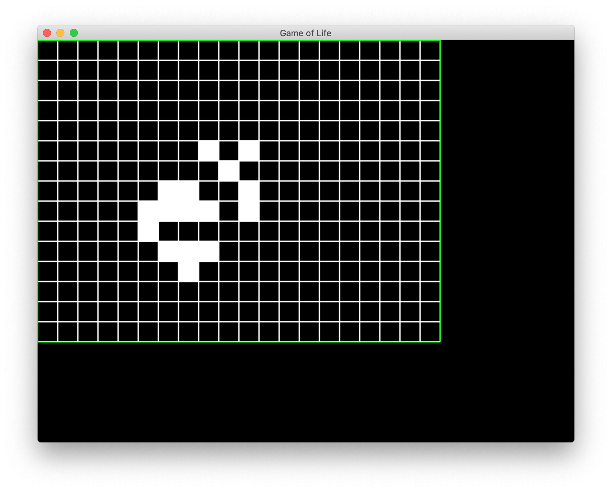

# gameoflife
John Conway's game of life. Personal project. Uses sdl2 and c++.
More about Game of life: https://en.wikipedia.org/wiki/Conway%27s_Game_of_Life

- If living cell has less than 2 neighbours, it dies.
- If living cell has more than 3 neighbours, it dies.
- If dead cell has 3 neighbours, it comes back to life.
------
- space: play / pause
- c: clear cells

